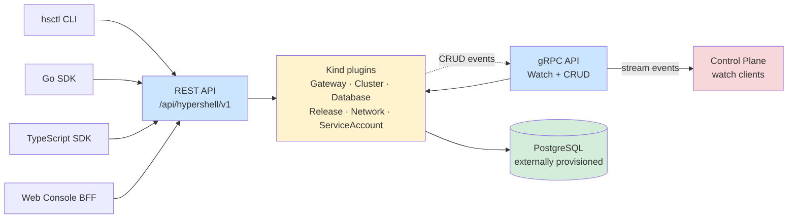

# API server

The Go API server is the source of truth for desired HyperShell resource state. REST serves humans and SDKs; gRPC watch streams drive reconciliation.

Authoritative source: components/api-server/CLAUDE.md; specs/platform/api-server-observability.spec.md

### API server boundaries: generated Kind plugins provide uniform CRUD, persistence, REST and gRPC presentation, while the control plane consumes watch events.

