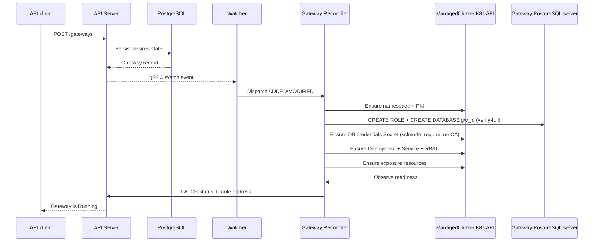
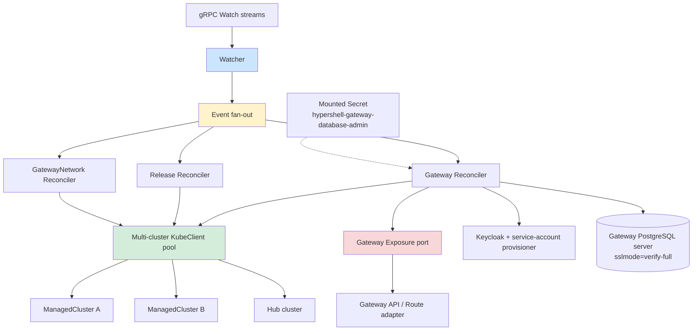

# Control plane

The control plane follows an informer-reconciler pattern: one watcher maintains gRPC streams and dispatches events to resource-specific reconcilers.

Authoritative source: specs/platform/control-plane.spec.md; components/control-plane/

### Event-driven reconciliation from a persisted Gateway to Kubernetes resources on the target ManagedCluster.

### Control-plane internal components and the multi-cluster client pool.

