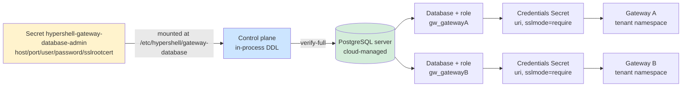
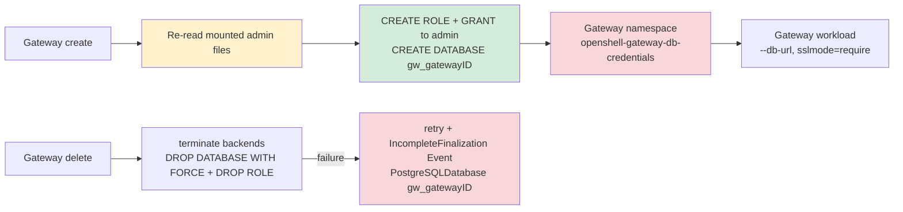

# Database architecture

Each HyperShell installation uses one externally provisioned PostgreSQL server for gateway databases. Its admin credentials and CA bundle reach the control plane as a mounted Secret; HyperShell never creates, resizes or deletes the server, and the control plane provisions one database and one login role per gateway inside it over a `verify-full` admin TLS connection. The gateway's own connection to its database uses `sslmode=require` instead: the upstream OpenShell Helm chart the gateway is deployed through has no mechanism to mount a CA bundle for this connection.

Authoritative source: specs/platform/openshell-gateway-database.spec.md

### One server backs every gateway, each with an isolated database and role.

### Provisioning and cleanup

No PostgreSQL workload runs in the cluster and no database resource exists in the API: the gateway namespace holds only the credentials Secret, and the admin credentials never leave the control-plane namespace.
