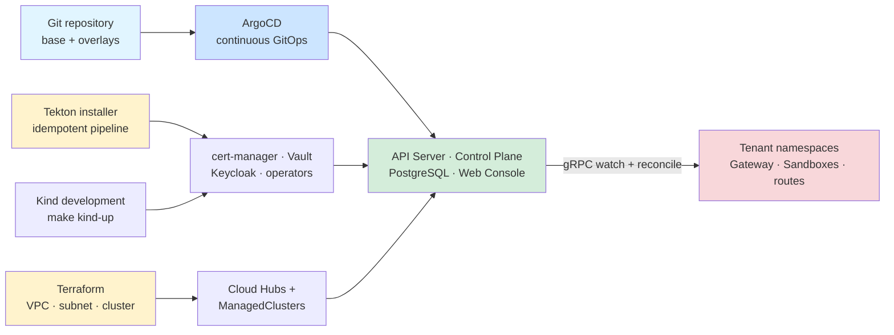

# Provisioning and delivery

Terraform provisions cloud infrastructure; Tekton provides deterministic installation; ArgoCD continuously reconciles Git-managed cluster state; the control plane handles tenant resources.

Authoritative source: specs/platform/global-architecture.spec.md; specs/platform/local-development.spec.md; .tekton/

### Infrastructure and application delivery responsibilities are separated by lifecycle and scope.

