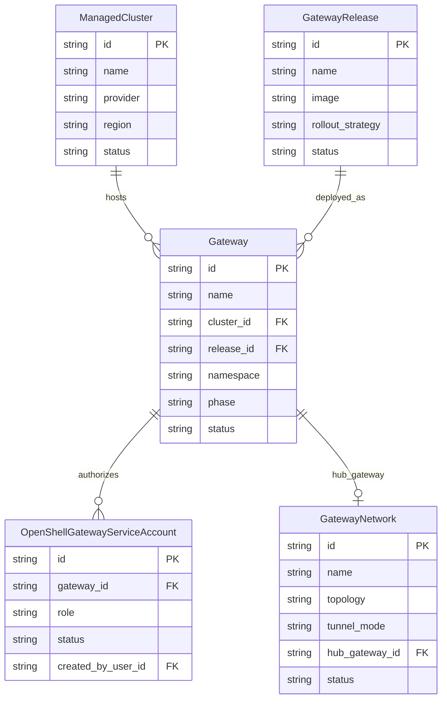

# Domain model

The API models top-level placement, release, gateway, network, and gateway-scoped automation resources. Gateway databases are not API resources; the control plane provisions them from a mounted admin credential Secret. Tenancy is enforced through platform-level and per-gateway RBAC rather than resource grouping.

Authoritative source: specs/platform/data-model.spec.md; specs/security/rbac-enforcement.spec.md

### Current API relationships. Resources are top-level; placement and release references converge on Gateway, while service accounts are scoped to one Gateway.

