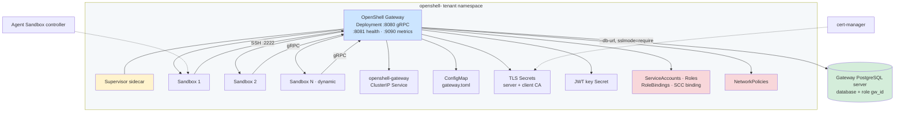

# Gateway workload

Each Gateway receives an API-assigned namespace containing the OpenShell Gateway, its Supervisor, dynamic Sandboxes, security policy, certificates, and access configuration.

Authoritative source: specs/platform/openshell-gateway.spec.md; specs/platform/openshell-gateway-sandbox-count.spec.md

### Namespace-per-Gateway is the isolation and lifecycle boundary. The control plane owns the Kubernetes resources; the Gateway owns sandbox runtime state.

