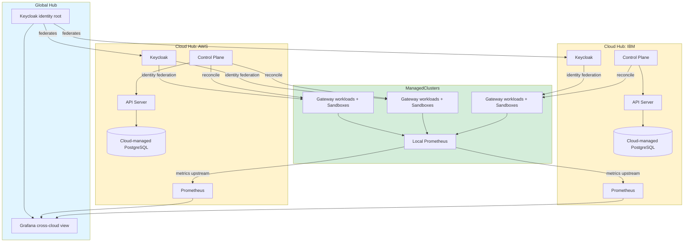

# Platform topology

The three-tier hub-and-spoke topology separates global identity, cloud-level operations, and regional OpenShell Gateway workloads.

Authoritative source: specs/platform/global-architecture.spec.md

### Global Hub → Cloud Hubs → ManagedClusters. The control plane reconciles tenant workloads downward while metrics aggregate upward.

