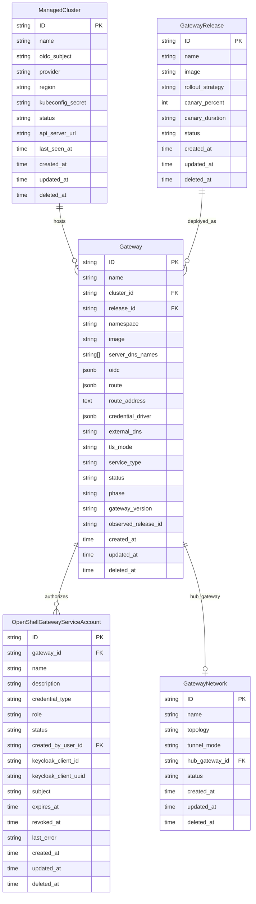

# Data Model

**Date:** 2026-08-03
**Status:** Active

## Overview

The HyperShell API server provides a control plane for deploying and managing distributed API gateways across multiple Kubernetes clusters and cloud providers.

Gateways, clusters, releases, and networks are **top-level resources**. An earlier model included a top-level "Sector" (later renamed "Fleet") organizational unit that grouped these resources via a `fleet_id`; that layer has been removed. There is no sectorization: all gateways belong to the same platform, and tenancy is enforced by RBAC (platform-level `gateway:creator`/`platform:admin` and per-gateway `gateway:owner`/`gateway:viewer`), not by a fleet grouping. See [`security/rbac-enforcement.spec.md`](../security/rbac-enforcement.spec.md).

Current model:

- **ManagedCluster** - a Kubernetes cluster registered into the platform. Tracks provider, region, API server URL, and a kubeconfig secret reference.
- **GatewayRelease** - a versioned container image for gateway deployments. Supports rollout strategies with canary percent/duration controls.
- **Gateway** - an API gateway instance deployed onto a specific cluster, using a specific release, within an API-assigned namespace. Its PostgreSQL database is not modelled in the API: the control plane provisions one database and login role per gateway on the platform's gateway database server (see [`openshell-gateway-database.spec.md`](./openshell-gateway-database.spec.md)). Tracks TLS mode, service type, external DNS, and lifecycle phase.
- **OpenShellGatewayServiceAccount** - a creator-bound automation identity for one Gateway. It stores an OpenShell role and non-secret Keycloak lifecycle metadata.
- **GatewayNetwork** - defines network connectivity topology between gateways. Supports tunnel modes and designates a hub gateway for hub-and-spoke or mesh networking.

## Entity Relationship Diagram



## Requirements

### Requirement: Top-Level Resources

ManagedCluster, GatewayRelease, Gateway, and GatewayNetwork SHALL be top-level resources. They SHALL NOT be scoped by a fleet or sector grouping, and their create and update contracts SHALL NOT include a `fleet_id` field.

#### Scenario: Create Gateway Without a Fleet Reference
- GIVEN a valid cluster_id and release_id
- WHEN a POST request is made to `/api/hypershell/v1/gateways`
- THEN a new Gateway is created as a top-level resource
- AND the Gateway references valid cluster and release resources
- AND the request SHALL NOT require or accept a `fleet_id`

#### Scenario: Create Gateway With a Direct Image Reference and No Release

- GIVEN a valid cluster_id and database_id
- AND an `image` and `supervisor_image` set directly, with no `release_id`
- WHEN a POST request is made to `/api/hypershell/v1/gateways`
- THEN a new Gateway is created with `release_id` unset
- AND the control plane reconciler provisions the gateway workload from the
  given `image` and `supervisor_image` rather than resolving a GatewayRelease

### Requirement: Gateway Namespace Ownership

The API server SHALL assign each Gateway an immutable Kubernetes namespace before persistence and before publishing its creation event. The namespace SHALL be `openshell-<id-hex-8>`, where `id-hex-8` is the lowercase hexadecimal encoding of 8 bytes from the Gateway KSUID's random payload, producing a 26-character namespace (e.g., `openshell-a1b2c3d4e5f67890`). This is stable, collision-safe for realistic gateway counts (~1 in 10^9 at 1M gateways), and a valid Kubernetes DNS label. Namespace SHALL be read-only in the REST contract and SHALL be absent from REST and gRPC create and update inputs.

#### Scenario: Create Gateways Without a Namespace

- GIVEN two valid Gateway create requests that omit namespace
- WHEN the API server creates both Gateways
- THEN each response SHALL contain a non-empty namespace derived from its Gateway identifier
- AND the namespaces SHALL be distinct Kubernetes DNS labels
- AND each creation event SHALL contain the same namespace that was persisted

#### Scenario: Namespace Cannot Be Selected or Updated

- GIVEN the REST and gRPC Gateway contracts
- WHEN a client constructs a create or update request
- THEN namespace SHALL NOT be available as an input field
- AND the API-assigned namespace SHALL remain available on Gateway responses and events

### Requirement: Gateway Provisioning Fields

A Gateway SHALL include provisioning configuration fields that the control plane uses to deploy and configure the OpenShell gateway workload on a target cluster. `release_id` SHALL be optional on create and update: a Gateway MAY be created with `image` set and no `release_id` (for example, the branch-build workflow in [`openshell-branch-build.spec.md`](./openshell-branch-build.spec.md), which provisions a Gateway from a direct `image`/`supervisor_image` reference with no GatewayRelease behind it), in which case the reconciler uses `image` directly and no rollout management (canary, rollback) applies. The REST and gRPC create/update requests SHALL accept a Gateway with neither `release_id` nor `image` set, in which case the control-plane `GATEWAY_IMAGE`/`GATEWAY_SUPERVISOR_IMAGE` environment defaults apply (see [`openshell-gateway.spec.md`](./openshell-gateway.spec.md)).

> **Relationship to release and database management fields:** The `image` field provides a direct image reference for the control plane reconciler, while `release_id` references a GatewayRelease for rollout management (canary, rollback). When both are set, `release_id` takes precedence and the reconciler resolves it to an image. A Gateway carries no database configuration at all: the control plane provisions each gateway's database and login role on the platform's gateway database server using the admin credential Secret mounted into the controller (see [`openshell-gateway-database.spec.md`](./openshell-gateway-database.spec.md)).

All fields in the table below SHALL be part of the REST and gRPC Gateway create and update contract as optional inputs (except where marked read-only), exposed through the generated OpenAPI schema (`components/api-server/openapi/openapi.gateways.yaml`) and gRPC message the same way `image`, `supervisor_image`, and `credential_driver` already are, and SHALL be added to the `gateways` table via a schema migration. This applies in particular to `sandbox_image`, `dev_build`, and `dev_build_metadata`, which are new fields introduced by [`openshell-branch-build.spec.md`](./openshell-branch-build.spec.md) and are not yet present in the implemented schema or OpenAPI contract.

`sandbox_image` SHALL be a desired-spec field: a change to it SHALL cause the control plane to re-provision the gateway (Helm upgrade), the same as a change to `image` or `supervisor_image`. If the control plane uses a generation/`observed_generation` pair and a desired-state comparison to decide whether to re-provision, `sandbox_image` SHALL be included in that comparison. `dev_build` and `dev_build_metadata` SHALL also be included, because a change to either must be re-applied onto workload labels and annotations through Helm values.

| Field | Type | Description |
|---|---|---|
| `image` | string | Gateway container image reference (e.g., `quay.io/opendatahub/odh-openshell-gateway:v0.0.109-rhaiv.0@sha256:a80b79e514826e8d57ea137749cf18a6e7f3d92e26bfefe005f3a9c4a55b8bdd`) |
| `supervisor_image` | string | Supervisor sidecar container image (default supplied by `GATEWAY_SUPERVISOR_IMAGE` env var on the control-plane deployment; see `deploy/base/controller.yaml`) |
| `sandbox_image` | string | Sandbox base image the gateway uses when launching sandboxes (default: `ghcr.io/nvidia/openshell-community/sandboxes/base:latest`). Control plane passes the resolved value as Helm `server.sandboxImage`. See [`openshell-gateway.spec.md`](./openshell-gateway.spec.md) |
| `server_dns_names` | string[] | DNS names for TLS certificate SANs |
| `oidc` | JSONB | OIDC authentication config: `{issuer, audience, jwks_ttl, roles_claim, admin_role, user_role, scopes_claim}` |
| `route` | JSONB | Route exposure config for GRPCRoute provisioning: `{host}` |
| `route_address` | text | Read-only external address populated by the control plane (e.g., `grpcs://hostname:443`) |
| `gateway_version` | string | Read-only runtime version from the last successful gateway health response |
| `observed_release_id` | string | Read-only (control-plane-owned) release currently rolled out and observed healthy; advanced only after a new revision passes its health gates. Distinct from the desired `release_id`. See [`gateway-release-rollout.spec.md`](./gateway-release-rollout.spec.md) |
| `credential_driver` | JSONB | Credential storage driver config: `{type, kubernetes_secrets, vault}`. See [`openshell-gateway-credentials.spec.md`](./openshell-gateway-credentials.spec.md) |
| `dev_build` | boolean | Marks this Gateway as a dev/branch build (default: false). Control plane passes `hypershell.redhat.io/openshell-dev-build` via Helm `podLabels`. See [`openshell-branch-build.spec.md`](./openshell-branch-build.spec.md) |
| `dev_build_metadata` | JSONB | Dev build provenance: `{ref, sha, repo}`. Control plane passes these via Helm `podAnnotations`. See [`openshell-branch-build.spec.md`](./openshell-branch-build.spec.md) |

See [`openshell-gateway.spec.md`](./openshell-gateway.spec.md) and its sub-specs for full provisioning details.

### Requirement: Gateway Deployment Lifecycle

A Gateway SHALL track its deployment lifecycle through the `phase` field. The `status` field SHALL reflect operational health.

#### Scenario: Gateway Phase Progression
- GIVEN a Gateway in phase "Pending"
- WHEN the control plane provisions it on the target cluster
- THEN the phase SHALL transition to "Provisioning"
- AND upon successful deployment, to "Running"

### Requirement: Canary Release Strategy

A GatewayRelease SHALL support canary deployment via `rollout_strategy`, `canary_percent`, and `canary_duration` fields.

#### Scenario: Canary Rollout
- GIVEN a GatewayRelease with `rollout_strategy: canary`, `canary_percent: 10`, `canary_duration: 30m`
- WHEN the release is deployed
- THEN 10% of traffic SHALL route to the new version
- AND after 30 minutes, the rollout SHALL proceed to full deployment

### Requirement: Network Topology

A GatewayNetwork SHALL define how gateways communicate. The `topology` field indicates the network shape and `tunnel_mode` the encapsulation method.

#### Scenario: Hub-and-Spoke Network
- GIVEN a GatewayNetwork with `topology: hub-spoke` and a `hub_gateway_id`
- WHEN gateways join the network
- THEN all spoke gateways SHALL route through the hub gateway

## API Reference

All routes under `/api/hypershell/v1/`:

| Method | Path | Operation |
|--------|------|-----------|
| GET/POST | `/gateways` | List/Create |
| GET/PATCH/DELETE | `/gateways/{id}` | Get/Update/Delete |
| GET/POST | `/gateways/{gateway_id}/service_accounts` | List/Create gateway OpenShellGatewayServiceAccounts |
| GET/DELETE | `/gateways/{gateway_id}/service_accounts/{service_account_id}` | Get/Delete an OpenShellGatewayServiceAccount |
| POST | `/gateways/{gateway_id}/service_accounts/{service_account_id}/revoke` | Permanently revoke an OpenShellGatewayServiceAccount |
| GET/POST | `/gateway_networks` | List/Create |
| GET/PATCH/DELETE | `/gateway_networks/{id}` | Get/Update/Delete |
| GET/POST | `/gateway_releases` | List/Create |
| GET/PATCH/DELETE | `/gateway_releases/{id}` | Get/Update/Delete |
| GET/POST | `/managed_clusters` | List/Create |
| GET/PATCH/DELETE | `/managed_clusters/{id}` | Get/Update/Delete |
| POST | `/managed_clusters/registration` | Self-register spoke; idempotent on (oidc_subject, name); updates last_seen_at on every call |

## CLI Reference (`hsctl`)

The `hsctl` CLI mirrors the REST API 1-for-1. Every REST operation has a corresponding command.

### API ↔ CLI Mapping

#### Gateways

| REST API | `hsctl` Command | Status |
|---|---|---|
| `GET /api/hypershell/v1/gateways` | `hsctl list gateways` | ✅ implemented |
| `GET /api/hypershell/v1/gateways/{id}` | `hsctl get gateway <id>` | ✅ implemented |
| `POST /api/hypershell/v1/gateways` | `hsctl create gateway --name <n> --cluster-id <c> --release-id <r> [--image <i>] [--external-dns <dns>] [--tls-mode <mode>]` | ✅ implemented |
| `PATCH /api/hypershell/v1/gateways/{id}` | `hsctl update gateway <id> [--name <n>] [--image <i>]` | 🔲 planned |
| `DELETE /api/hypershell/v1/gateways/{id}` | `hsctl delete gateway <id>` | ✅ implemented |

#### OpenShellGatewayServiceAccounts

| REST API | `hsctl` Command | Status |
|---|---|---|
| `GET /api/hypershell/v1/gateways/{gateway_id}/service_accounts` | `hsctl list serviceAccounts --gateway-id <gateway_id>` | ✅ implemented |
| `GET /api/hypershell/v1/gateways/{gateway_id}/service_accounts/{id}` | `hsctl get serviceAccount <id> --gateway-id <gateway_id>` | ✅ implemented |
| `POST /api/hypershell/v1/gateways/{gateway_id}/service_accounts` | `hsctl create serviceAccount --gateway-id <gateway_id> --name <n> --role <role> [--expires-in <duration>]` (`role`: `openshell-user` or `openshell-admin`) | ✅ implemented |
| `POST /api/hypershell/v1/gateways/{gateway_id}/service_accounts/{id}/revoke` | `hsctl revoke serviceAccount <id> --gateway-id <gateway_id>` | ✅ implemented |
| `DELETE /api/hypershell/v1/gateways/{gateway_id}/service_accounts/{id}` | `hsctl delete serviceAccount <id> --gateway-id <gateway_id>` | ✅ implemented |

#### Gateway Networks

| REST API | `hsctl` Command | Status |
|---|---|---|
| `GET /api/hypershell/v1/gateway_networks` | `hsctl list gatewayNetworks` | ✅ implemented |
| `GET /api/hypershell/v1/gateway_networks/{id}` | `hsctl get gatewayNetwork <id>` | ✅ implemented |
| `POST /api/hypershell/v1/gateway_networks` | `hsctl create gatewayNetwork --name <n> --topology <t> [--tunnel-mode <m>] [--hub-gateway-id <g>]` | ✅ implemented |
| `PATCH /api/hypershell/v1/gateway_networks/{id}` | `hsctl update gatewayNetwork <id> [--topology <t>]` | 🔲 planned |
| `DELETE /api/hypershell/v1/gateway_networks/{id}` | `hsctl delete gatewayNetwork <id>` | ✅ implemented |

#### Gateway Releases

| REST API | `hsctl` Command | Status |
|---|---|---|
| `GET /api/hypershell/v1/gateway_releases` | `hsctl list gatewayReleases` | ✅ implemented |
| `GET /api/hypershell/v1/gateway_releases/{id}` | `hsctl get gatewayRelease <id>` | ✅ implemented |
| `POST /api/hypershell/v1/gateway_releases` | `hsctl create gatewayRelease --name <n> --image <i> [--rollout-strategy <s>] [--canary-percent <p>] [--canary-duration <d>]` | ✅ implemented |
| `PATCH /api/hypershell/v1/gateway_releases/{id}` | `hsctl update gatewayRelease <id> [--image <i>] [--rollout-strategy <s>]` | 🔲 planned |
| `DELETE /api/hypershell/v1/gateway_releases/{id}` | `hsctl delete gatewayRelease <id>` | ✅ implemented |

#### Managed Clusters

| REST API | `hsctl` Command | Status |
|---|---|---|
| `GET /api/hypershell/v1/managed_clusters` | `hsctl list managedClusters` | ✅ implemented |
| `GET /api/hypershell/v1/managed_clusters/{id}` | `hsctl get managedCluster <id>` | ✅ implemented |
| `POST /api/hypershell/v1/managed_clusters` | `hsctl create managedCluster --name <n> --provider <p> --region <r> --api-server-url <url> --kubeconfig-secret <s>` | ✅ implemented |
| `PATCH /api/hypershell/v1/managed_clusters/{id}` | `hsctl update managedCluster <id> [--status <s>]` | 🔲 planned |
| `DELETE /api/hypershell/v1/managed_clusters/{id}` | `hsctl delete managedCluster <id>` | ✅ implemented |

#### RBAC

| REST API | `hsctl` Command | Status |
|---|---|---|
| `GET /api/hypershell/v1/roles` | `hsctl list roles` | ✅ implemented |
| `GET /api/hypershell/v1/roles/{id}` | `hsctl get role <id>` | ✅ implemented |
| `POST /api/hypershell/v1/roles` | `hsctl create role --name <n> [--permissions <json>]` | ✅ implemented |
| `DELETE /api/hypershell/v1/roles/{id}` | `hsctl delete role <id>` | ✅ implemented |
| `GET /api/hypershell/v1/role_bindings` | `hsctl list roleBindings` | ✅ implemented |
| `GET /api/hypershell/v1/role_bindings/{id}` | `hsctl get roleBinding <id>` | ✅ implemented |
| `POST /api/hypershell/v1/role_bindings` | `hsctl create roleBinding --role-id <r> --scope <s> [--user-id <u>]` | ✅ implemented |
| `DELETE /api/hypershell/v1/role_bindings/{id}` | `hsctl delete roleBinding <id>` | ✅ implemented |

#### Users

| REST API | `hsctl` Command | Status |
|---|---|---|
| `GET /api/hypershell/v1/users` | `hsctl list users` | ✅ implemented |
| `GET /api/hypershell/v1/users/{id}` | `hsctl get user <id>` | ✅ implemented |
| `POST /api/hypershell/v1/users` | `hsctl create user --name <n> [--email <e>] [--external-id <id>]` | ✅ implemented |

#### Auth & Context

| Operation | `hsctl` Command | Status |
|---|---|---|
| Authenticate (browser PKCE) | `hsctl login --url <url> --issuer-url <issuer>` | ✅ implemented |
| Authenticate (device flow) | `hsctl login --no-browser --url <url> --issuer-url <issuer>` | ✅ implemented |
| Authenticate (static token) | `hsctl login --token-file <path> --url <url>` | ✅ implemented |
| Log out | `hsctl logout` | ✅ implemented |
| Identity | `hsctl whoami` | ✅ implemented |
| Config get | `hsctl config get <key>` | ✅ implemented |
| Config set | `hsctl config set <key> <value>` | ✅ implemented |

### `hsctl apply` - Declarative Resource Management

`hsctl apply` reconciles Gateways and infrastructure from declarative YAML files, mirroring `kubectl apply` semantics.

#### Supported Kinds

| Kind | Fields applied | Status |
|---|---|---|
| `Gateway` | `name`, `cluster_id`, `release_id`, `image`, `supervisor_image`, `sandbox_image`, `server_dns_names`, `oidc`, `route`, `external_dns`, `tls_mode`, `service_type`, `dev_build`, `dev_build_metadata` | ✅ implemented |
| `GatewayNetwork` | `name`, `topology`, `tunnel_mode`, `hub_gateway_id` | ✅ implemented |
| `GatewayRelease` | `name`, `image`, `rollout_strategy`, `canary_percent`, `canary_duration` | ✅ implemented |
| `ManagedCluster` | `name`, `provider`, `region`, `kubeconfig_secret`, `api_server_url` | ✅ implemented |

#### `-f` - File or Directory

```sh
hsctl apply -f <file>               # apply a single YAML file
hsctl apply -f <dir>                # apply all *.yaml files in the directory (non-recursive)
hsctl apply -f -                    # read from stdin
```

Each file may contain one or more YAML documents separated by `---`. Documents with unrecognized `kind` values are skipped with a warning.

Apply behavior per resource:
- **Gateway**: if a gateway with matching `name` exists, `PATCH` it. Otherwise, `POST` to create it.
- Similar upsert logic for all other resource types.

Output (default - one line per resource):

```
gateway/api-gw-us-east created
gateway/api-gw-eu-west configured
managedCluster/eks-us-east-1 unchanged
```

With `-o json`: JSON array of all applied resources.

#### `-k` - Kustomize Directory

```sh
hsctl apply -k <dir>                # build kustomization in <dir> and apply the result
```

Equivalent to: build the kustomization (resolve `bases`, `resources`, merge `patches`) into a flat manifest stream, then apply each document in order.

The kustomization schema is a subset of Kubernetes Kustomize:

```yaml
kind: Kustomization

resources:           # relative paths to YAML files included in this build
  - gateways/
  - releases/

bases:               # other kustomization directories to include first
  - ../../base

patches:             # strategic-merge patches applied after resource collection
  - path: gateway-patch.yaml
    target:
      kind: Gateway
      name: api-gw-us-east
```

Patches use **strategic merge**: scalar fields overwrite, maps merge, sequences replace.

#### Examples

```sh
## Apply the full base configuration
hsctl apply -f .hypershell/base/

## Apply the prod overlay (resolves base + patches)
hsctl apply -k .hypershell/overlays/prod/

## Apply a single gateway file
hsctl apply -f gateways/api-gateway.yaml

## Dry-run: show what would change without applying
hsctl apply -k .hypershell/overlays/staging/ --dry-run

## Pipe from stdin
cat gateway.yaml | hsctl apply -f -
```

#### Flags

| Flag | Description | Status |
|---|---|---|
| `-f <path>` | File, directory, or `-` for stdin. Mutually exclusive with `-k`. | 🔲 planned |
| `-k <dir>` | Kustomize directory. Mutually exclusive with `-f`. | 🔲 planned |
| `--dry-run` | Print what would be applied without making API calls. | 🔲 planned |
| `-o json` | JSON output (array of applied resources). | 🔲 planned |

#### Status column

| Output | Meaning |
|---|---|
| `created` | Resource did not exist; POST succeeded. |
| `configured` | Resource existed; PATCH applied one or more changes. |
| `unchanged` | Resource existed and matched desired state; no API call made. |

### Global Flags

| Flag | Description |
|---|---|
| `--insecure-skip-tls-verify` | Skip TLS certificate verification |
| `-o json` | JSON output (most `get`/`create` commands) |
| `-o wide` | Wide table output |
| `--limit <n>` | Max items to return (default: 100) |

### Authentication Context

The CLI stores credentials and context in `~/.config/hypershell/config.json` (or `HYPERSHELL_CONFIG` env var override). The config holds the API server URL, OIDC issuer URL, client ID, access token, and refresh token.

```sh
# Interactive login (opens browser via PKCE)
hsctl login --url https://api.example.com --issuer-url https://keycloak.example.com/realms/hypershell

# Headless login (device flow -- prints a URL and code, polls until complete)
hsctl login --no-browser --url https://api.example.com --issuer-url https://keycloak.example.com/realms/hypershell

hsctl list gateways
hsctl create gateway --name api-gateway --cluster-id eks-1 --release-id v1.0
```


## Design Decisions

| Decision | Rationale |
|----------|-----------|
| KSUID for all IDs | Sortable, globally unique, no coordination required |
| Resources are top-level | Sector/Fleet grouping was removed; tenancy is enforced by RBAC (platform + per-gateway), not by a resource grouping |
| Separate Release from Gateway | Decouples versioning from deployment; enables canary and rollback |
| GatewayNetwork as explicit entity | Makes network topology declarative and auditable |
| Secret references (not inline secrets) | Keeps secrets in K8s Secrets, not in the database |
